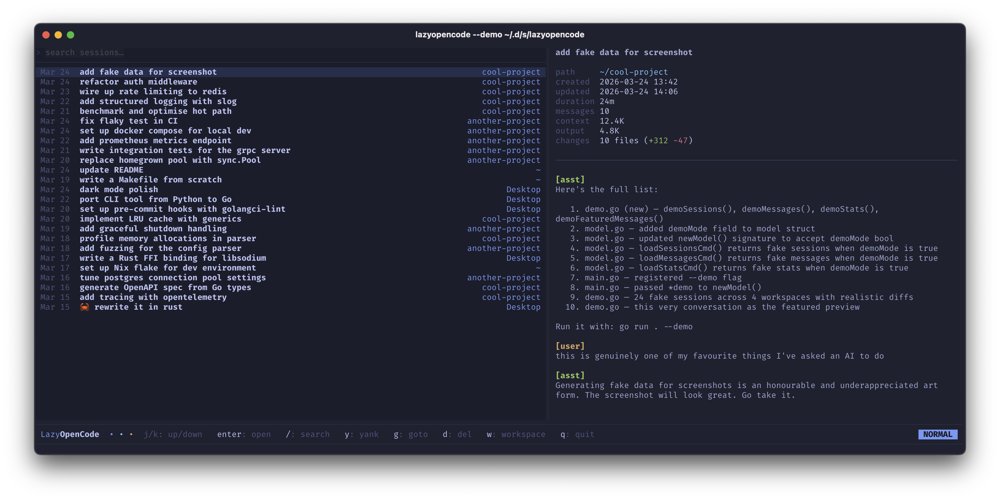

# lazyopencode

**The lazier way to work with [OpenCode](https://opencode.ai)**. Browse, search, and preview sessions. Group by workspace, view stats, yank paths or IDs, open a shell in any session's directory, delete sessions individually or in bulk, etc.



## Requirements

Requires [OpenCode](https://opencode.ai) (duh). Supported platforms: `darwin/amd64`, `darwin/arm64`.

## Install

### Homebrew via [homebrew-lazyopencode](https://github.com/ActionScripted/homebrew-lazyopencode)

    brew install actionscripted/lazyopencode/lazyopencode

To upgrade:

    brew upgrade lazyopencode

**Other methods:**

- download a binary from [GitHub Releases](https://github.com/ActionScripted/lazyopencode/releases/latest) and move it onto your `$PATH`
- run `go install github.com/actionscripted/lazyopencode@latest` (requires Go 1.25+)
- build from source with `make install` (requires Go 1.25+, symlinks to `~/.local/bin/lazyopencode`).

## Usage

```sh
lazyopencode
```

## Keybinds

We're going for Vim-style binds for speed. We have a normal mode with sessions, search and a workspace mode for extra laziness.

### Modes

| Key | Mode       | Notes                                                    |
| --- | ---------- | -------------------------------------------------------- |
| `/` | Search     | Type to filter; `esc` to exit                            |
| `w` | Workspaces | `d` deletes all sessions in workspace; `w`/`esc` to exit |

### Movement

| Key         | Action                |
| ----------- | --------------------- |
| `j` / `↓`   | Down                  |
| `k` / `↑`   | Up                    |
| `enter`     | Open selected session |
| `q` / `esc` | Quit / back           |

### Chords

| Keys | Action                               |
| ---- | ------------------------------------ |
| `dd` | Delete selected session              |
| `gs` | Open `$SHELL` in session's directory |
| `gw` | Jump to session's workspace          |
| `yd` | Yank session directory to clipboard  |
| `ys` | Yank session ID to clipboard         |

## Development

Install dev tools:

```sh
brew install golangci-lint
go install golang.org/x/tools/cmd/goimports@latest
```

| Command      | What it does                                    |
| ------------ | ----------------------------------------------- |
| `make check` | fmt + vet + lint + test (run before committing) |
| `make fmt`   | Format with gofmt and goimports                 |
| `make vet`   | Run go vet                                      |
| `make lint`  | Run golangci-lint                               |
| `make test`  | Run go test ./...                               |

## Releases

Releases are cut by pushing a semver tag. The GitHub Actions release workflow builds binaries for all supported platforms and publishes them to GitHub Releases with auto-generated release notes. Pushing a release will also auto-update the Homebrew repo.

```sh
git tag v0.1.0
git push origin v0.1.0
```

## Contributing

Issues and PRs are welcome! Nothing formal now, just open one and we'll see how things go. This is a free thing built to scratch an itch though and I reserve the right not to jump at every issue or request. That said, all help is welcome including new ideas or features.

## License

[MIT](LICENSE)
